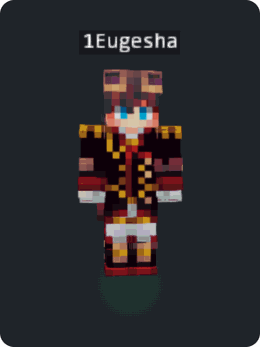

# SkinEngine

**Живой 3D-скин Minecraft для любого сайта.** Один файл скрипта — и на странице
появляется «живой» персонаж: дышит, покачивается, оглядывается, реагирует на
клики, поворачивается мышью и носит плащ с физикой ткани.

Автор: **1Eugesha** · Лицензия: MIT

<p align="center">
  
  <br>
  <em><a href="https://1eugesha.github.io/skin-engine/">▶ Живая демка</a></em>
</p>

---

## Возможности

- 🧍 **Живая стойка (idle)** — плавное «дыхание» + случайные анимации-оживители
  раз в ~8 секунд (встроенный набор профессиональных клипов) + взгляд за
  курсором.
- 🚶 **Режимы**: `idle()` / `walk()` (походка на месте) / `stand()` (статика).
- 🖱️ **Интерактив**: перетаскивание — вращение с инерцией; клик — анимация
  «interact» + пружинный «сквош»-отклик; серия кликов — красная вспышка урона.
- 🏷️ **Нейм-тег** над головой в стиле Minecraft (`nameTag`); если на странице
  подключён шрифт `Minecraft` (`@font-face`), надпись рисуется им.
- 👤 **Авто-slim**: тип модели (classic / slim) определяется по текстуре скина
  автоматически, риг перестраивается на лету при смене скина.
- 🧥 **Плащ** с физикой ткани (8 сегментов, ветер, инерция) — `setCape(url)`,
  плюс хелпер `SkinEngine.loadCape(nick)` для автопоиска плаща по нику.
- 🔄 **Смена скина** — кинематографичный разворот: текстура подменяется, когда
  модель спиной к камере (`setSkin(url)`).
- 🦴 **Честный риг**: сгиб локтей/коленей в настоящем суставе, наклон корпуса
  в поясе. **Части тела никогда не отрываются и не рвутся**: суставы закрыты
  вставками-заглушками, смещения конечностей мягко ограничены (tanh) — любые
  данные анимации дают цельного персонажа, как в самой игре.
- 🎞️ **Проигрыватель анимаций** — `play(data)` принимает JSON-треки
  (формат ниже), с бесшовным зацикливанием и кроссфейдом между режимами.
- ⚡ **Производительность**: пауза рендера вне экрана/вкладки (`setPaused`),
  детект программного WebGL, без аллокаций в горячем цикле кадра.

Под капотом — [skinview3d](https://github.com/bs-community/skinview3d)
(подгружается с CDN автоматически, на странице ничего ставить не нужно).

## Быстрый старт

Самый короткий путь — веб-компонент, ноль строк JavaScript:

```html
<script src="https://cdn.jsdelivr.net/gh/1Eugesha/skin-engine@main/skin-engine.anims.js"></script>
<script src="https://cdn.jsdelivr.net/gh/1Eugesha/skin-engine@main/skin-engine.js"></script>

<skin-viewer nick="1Eugesha"></skin-viewer>
```

`nick` сам подтянет скин, плащ (если есть) и нейм-тег. Атрибуты:
`nick` · `skin` (URL текстуры) · `name-tag` · `cape` (URL / `auto` / `none`) ·
`elytra` (URL текстуры плаща → крылья) · `width` · `height`.

Полный контроль — через JS API:

```html
<canvas id="skin"></canvas>
<script src="skin-engine.anims.js"></script>
<script src="skin-engine.js"></script>
<script>
  const stage = SkinEngine.mount(document.getElementById("skin"), {
    skin: "https://mc-heads.net/skin/1Eugesha", // URL текстуры скина
    nameTag: "1Eugesha",
    width: 300, height: 420,
  });
</script>
```

Всё. Персонаж уже живой: дышит, следит за курсором, реагирует на клики.
`skin-engine.anims.js` — пак фирменных анимаций (см. «Лицензия»); без него
движок работает на встроенном простом дыхании.

Чтобы нейм-тег рисовался майнкрафтовским шрифтом, подключи на странице:

```css
@font-face {
  font-family: "Minecraft";
  src: url("https://cdn.jsdelivr.net/gh/South-Paw/typeface-minecraft@1.0.0/files/minecraft.woff2") format("woff2");
}
```

**📖 Полная документация со всеми опциями, событиями, форматом анимаций и
рецептами (личный кабинет, React, аватарки): [docs/API.md](docs/API.md)**

## API

### `SkinEngine.mount(canvas, opts) → SkinStage`

| Метод | Что делает |
|-------|-----------|
| `await stage.ready` | дождаться инициализации |
| `stage.idle()` | живая стойка (по умолчанию) |
| `stage.walk()` | непрерывная походка на месте |
| `stage.stand()` | статичная поза |
| `stage.play(data)` | проиграть анимацию (JSON-треки, см. ниже) |
| `stage.stop()` | вернуться в idle |
| `stage.setSkin(url)` | сменить скин (разворот-эффект, авто-slim) |
| `stage.setCape(url)` / `clearCape()` | плащ |
| `stage.setElytra(url)` | элитры (крылья) из текстуры плаща |
| `stage.setEars(url)` | уши (текстура ушей) |
| `stage.setNameTag(name)` | нейм-тег над головой (null — убрать) |
| `stage.snapshot()` | PNG-кадр (dataURL) — аватарки, обложки |
| `stage.hit(power)` | программный «клик» (interact + сквош-импульс) |
| `stage.damageFlash()` | красная вспышка урона |
| `stage.setPaused(on)` | пауза рендера вручную (по умолчанию движок работает всегда) |
| `stage.on(ev, cb)` / `off(ev, cb)` | события |
| `stage.dispose()` | освободить WebGL и обработчики |

**События**: `ready`, `hit` (0..1 — накопленная «энергия» кликов), `damage`,
`emoteend` (одноразовая анимация доиграла), `skinchange`, `skin`.

### Опции (`SkinEngine.defaults`)

| Опция | Дефолт | Описание |
|-------|--------|----------|
| `skin` | — | URL текстуры скина (можно позже через `setSkin`) |
| `width`, `height` | 300×420 | размер вьюпорта |
| `fov`, `zoom` | 45, 0.66 | камера |
| `idle` | `true` | живая стойка после загрузки |
| `gestures` | `true` | случайные анимации-оживители в idle (раз в ~8 с) |
| `nameTag` | `null` | нейм-тег над головой |
| `nameTagHeight` | `21.5` | высота нейм-тега над моделью |
| `interactive` | `true` | клики/тапы = отклик |
| `lookFollow` | `true` | голова следит за курсором |
| `intro` | `true` | интро-появление модели |
| `initialYaw` | `0.14` | стартовый разворот модели (рад) |
| `xfade` | `0.45` | длительность кроссфейда режимов, c |
| `skinSwapFx`, `spinDur` | `true`, `0.72` | разворот при смене скина |
| `lights` | `true` | витринный свет (rim + тёплый fill) |
| `pixelRatio` | `0` (авто) | плотность рендера: авто = clamp(dpr, 1.5…2.5); `1` — максимально дёшево |
| `clickMaxEnergy` | `5` | кликов до вспышки урона |
| `damageFlash`, `damageDecay` | `0.7`, `3.5` | сила и затухание вспышки |

### Формат анимации (`stage.play(data)`)

```js
{
  loop: true,          // зациклить (иначе — одноразовая, событие emoteend)
  stop: 40,            // длина в тиках (20 тиков = 1 секунда)
  end: 40, ret: 0,     // точки петли: конец и возврат
  tracks: {
    // канал: [[тик, значение], ...] — линейная интерполяция между ключами
    "rightArm.pitch": [[0, 0], [20, -2.4], [40, 0]],
    "rightArm.bend":  [[0, 0], [20, -1.8], [40, 0]],
    "torso.yaw":      [[0, 0], [20, 0.4], [40, 0]],
  }
}
```

Каналы: `head / rightArm / leftArm / rightLeg / leftLeg` ×
`pitch / yaw / roll / bend / x / y / z`, плюс `torso.*` (наклоны и смещение
всего тела) и `turn` (разворот). Углы в радианах, смещения в юнитах модели
(1 юнит = 1 пиксель текстуры). Смещения конечностей движок мягко ограничивает —
оторвать руку или голову данными анимации невозможно.

### Низкоуровневые примитивы

Для своих сценариев (рендер кадров, кастомные проигрыватели):
`SkinEngine.ensureRig`, `restPose`, `applyPose`, `applyAnimTick`, `sampleTrack`,
`fixTransparency`, `applyDamageTint`, `resetDamageTint`, `AnimPlayer(sv)`,
`loadCape(nick)`, `load()` (промис skinview3d), `gpu()` (детект ускорения).

## Как устроено (для любопытных)

- **Риг.** Верх тела (корпус + голова + руки) переносится в pivot-группу на
  уровне бёдер — корпус гнётся в поясе; ноги остаются независимыми.
- **Сгиб.** Каждая рука/нога разрезается пополам, нижняя половина живёт в
  суставе `__bendJoint`. UV половинок восстанавливаются аффинной картой по
  граням — текстура остаётся ровной.
- **Цельность.** В каждом суставе — вставка-заглушка, повёрнутая на половину
  угла сгиба: она закрывает клиновую щель между половинками при любом угле.
  Такая же вставка стоит в поясе. Позиционные смещения конечностей проходят
  через мягкий tanh-лимитер (свободно до 1.2 юнита, предел 2.4).
- **Микшер.** Все режимы — «источники поз» в смещениях от стойки покоя;
  движок кроссфейдит между источником и снимком предыдущей позы, поэтому
  конечности никогда не телепортируются.
- **Встроенные анимации.** Idle-дыхание, три «оживителя» и interact-отклик —
  запечённые треки (`SE_ANIMS`) в родном формате движка; планировщик запускает
  случайный оживитель раз в ~8 с с кроссфейдом 0.2 с и возвратом в idle.
- **Плащ.** Крепится к спине на уровне плеч (жёсткая привязка к тазовому
  pivot-у по позе покоя) и дальше живёт цепочкой из 8 сегментов с пружинной
  физикой: гравитация, следование, демпфирование, ветер с порывами.

## Файлы

| Файл | Что это |
|------|---------|
| `skin-engine.js` | движок, один файл, без сборки (MIT) |
| `skin-engine.anims.js` | пак анимаций idle/оживители/interact (GPL-3.0) |
| `skin-engine.mjs` | ES-модуль-обёртка (`import SkinEngine from "skin-engine"`) |
| `skin-engine.d.ts` | типы TypeScript |
| `demo.html` | демо-страница (живая: https://1eugesha.github.io/skin-engine/) |

Запуск локально: любой статический сервер в корне проекта, например
`npx http-server` или `py -m http.server`.

## Лицензия

Движок (`skin-engine.js`) — **MIT © 1Eugesha**. Используй свободно в своих
проектах — упоминание автора приветствуется.

Пак анимаций (`skin-engine.anims.js`) портирован из анимаций модели плеера
приложения Modrinth ([modrinth/code](https://github.com/modrinth/code),
`packages/assets`, © Rinth, Inc.) и распространяется под **GPL-3.0** — как
исходные ассеты. Не подходит GPL — просто не подключай этот файл: движок
откатится на встроенный idle-цикл.
